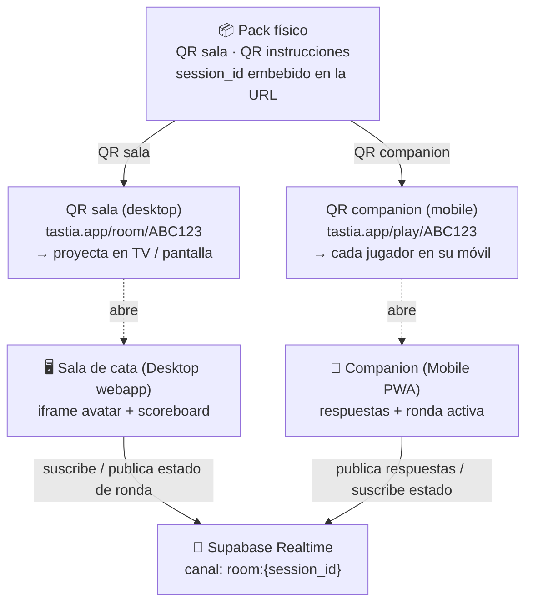

# Arquitectura — Tastia (cata en vivo)

Sesión de cata multijugador: una **Sala** en pantalla grande (desktop/TV) hace de tablero central
con el avatar y el marcador; cada jugador usa su móvil como **Companion**. Todo se sincroniza por
**Supabase Realtime** en un canal por sesión. El `session_id` viaja embebido en los QR del pack.

## Canal Realtime: `room:{session_id}`

**BROADCAST (host/Sala → todos los clientes)**
- `round_start` — empieza la cata del vino N (fase, índice de vino, temporizador)
- `round_end` — se cierran las apuestas de ese vino
- `wine_revealed` — se revela la ficha del vino + se reparten puntos
- `scores` — marcador actualizado

**PLAYER EVENTS (Companion → todos)**
- `player_joined` — un jugador entra en la sala (nombre/avatar)
- `ready` — jugador listo para empezar / siguiente ronda
- `answer_submitted` — apuesta del jugador (variedad, D.O., precio, añada)

## URLs y roles
- **`/room/:code`** — Sala (desktop). Tablero central: avatar (iframe) + marcador + estado de fase.
  Es la autoridad de la sesión (controla las transiciones de fase).
- **`/play/:code`** — Companion (móvil, PWA). Une al jugador, muestra la ronda activa, envía respuestas.
- `code` = `session_id` corto (p. ej. ABC123), embebido en el QR del pack.

## Mapeo al código (a construir sobre el scaffold actual de Lovable)
- Rutas TanStack Start: `src/routes/room/$code.tsx` y `src/routes/play/$code.tsx`.
- Cliente Supabase + hook de canal Realtime (`useRoomChannel(sessionId)`): presence + broadcast.
- Máquina de estados de la sesión: `lobby → intro → cata ×4 (servir/vista/nariz/boca/quiniela/revelación) → podio`.
- Avatar embebido por iframe en la Sala (proveedor a decidir: HeyGen / Anam / Tavus).
- Modelo de datos (Supabase): `tasting_sessions`, `session_participants`, `session_guesses`.

> Nota: esto es la capa multijugador (Approach C del design doc). Para la demo se puede arrancar
> con la Sala en un solo dispositivo y añadir el Companion cuando el canal Realtime esté sólido.
